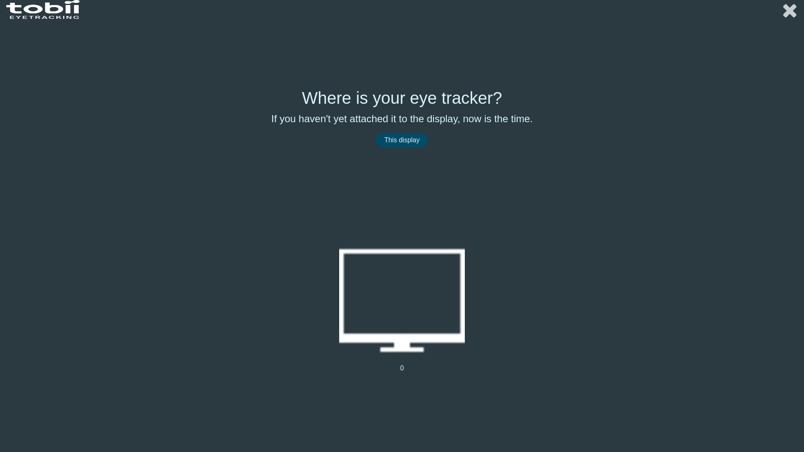
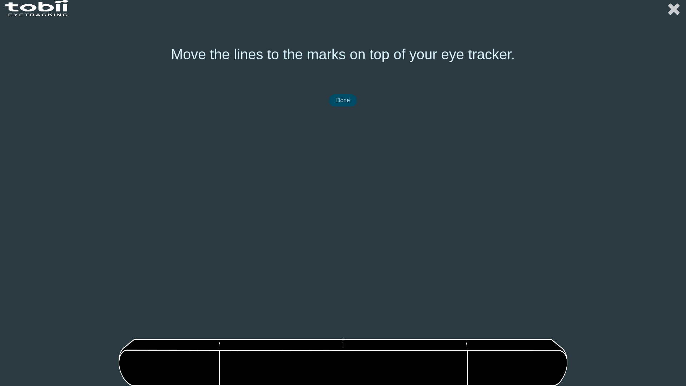
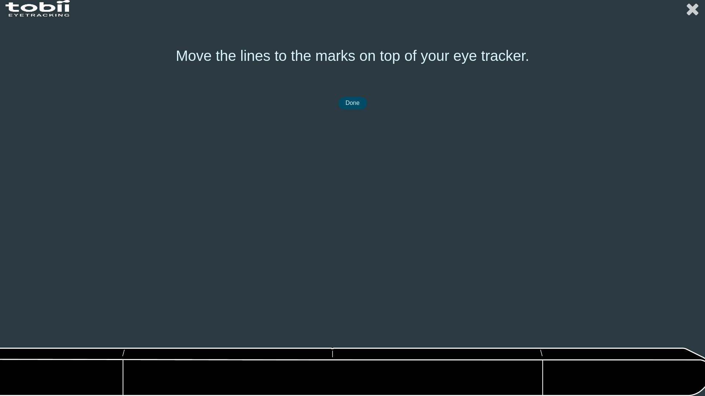
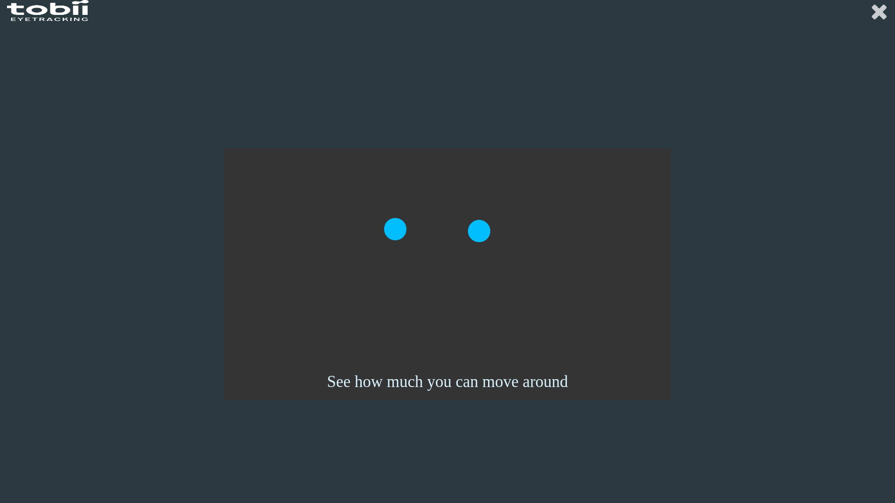
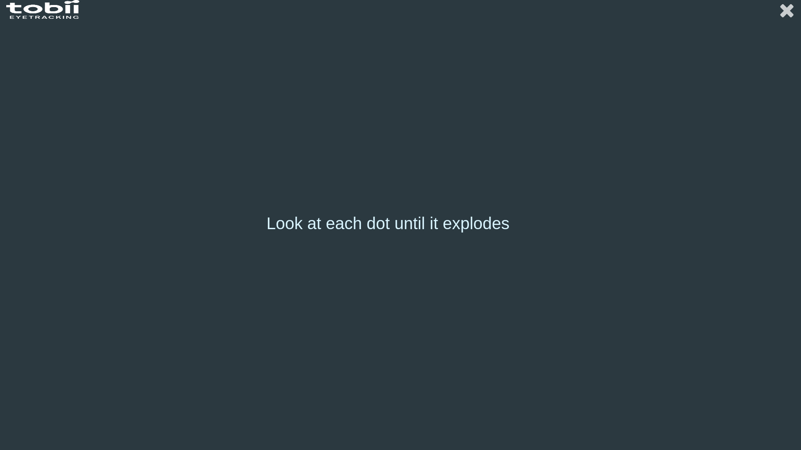
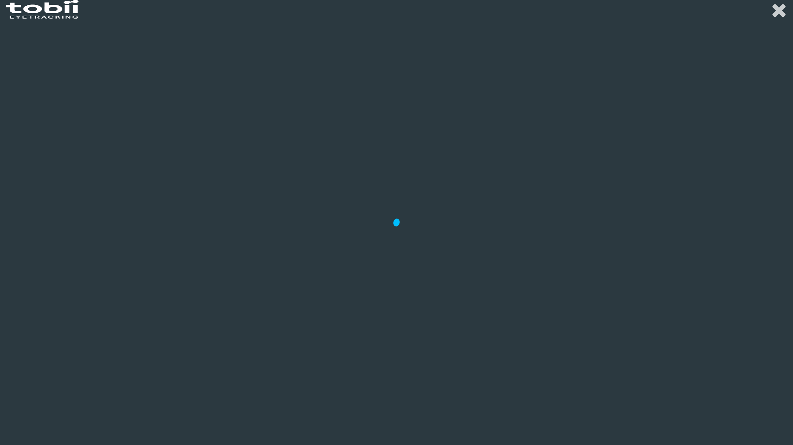
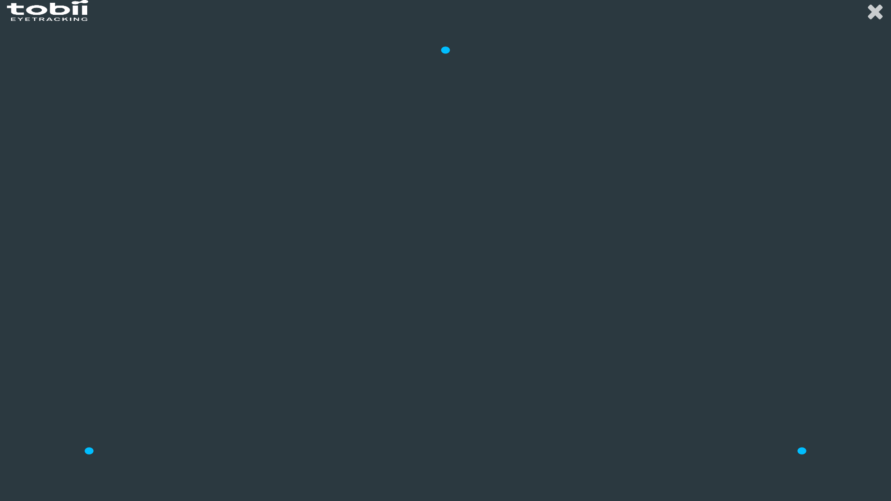
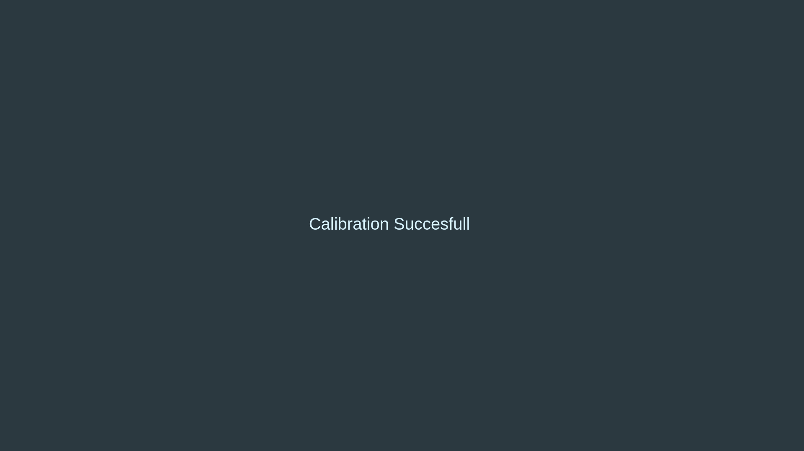
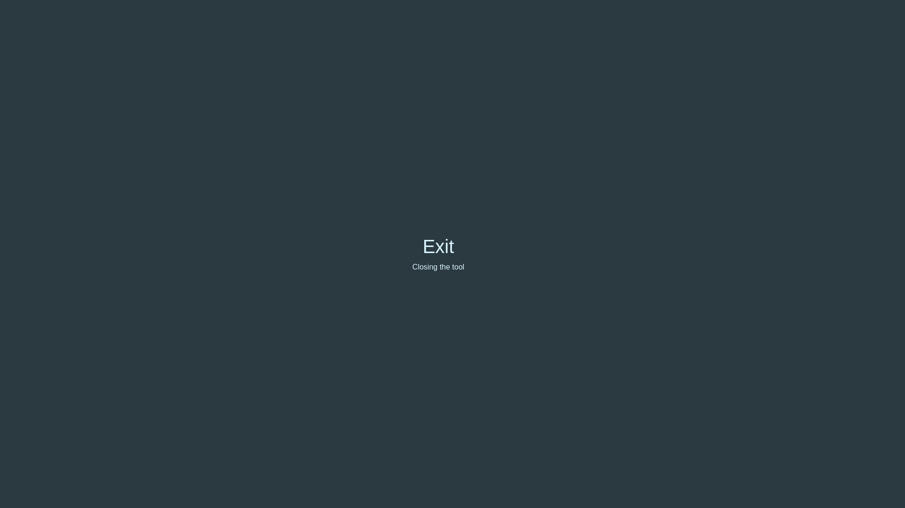
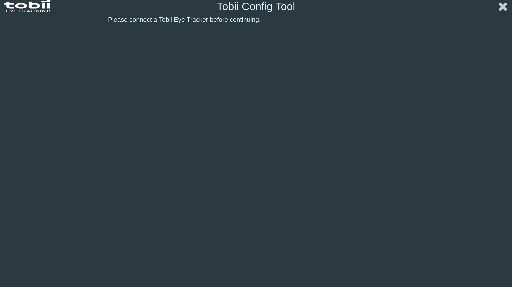

# Tobii_Config

Logiciel permettant de faire la calibration de sa commande oculaire.

## Étape 1: Démarrer la calibration

Avant de commencer la calibration de notre commande oculaire, on doit choisir l'écran que l'on va utiliser.

À cette étape, il faut bien attacher la commande oculaire à l'écran pour la suite (le mieux est en dessous de l'écran si possible).

## Étape 2: Placement de la commande oculaire

Après avoir choisi l'écran sur lequel on va utiliser notre commande oculaire.  
On va devoir régler la taille de notre commande oculaire.

Pour ce faire, il suffit (à l'aide de la souris) de déplacer les 2 lignes de l'image de la commande oculaire pour que ceux-ci soient les mêmes que notre commande occulaire.

Comme cela.

## Étape 3: Détection des yeux

Une fois le placement de la commande ocualaire finalisé, le logiciel va essayer de détecter vos yeux.  

Ce qui donne :

Puis après un certain temps, le logiciel va lancer la calibration de la commande oculaire.

## Étape 4: La calibration

Nous allons enfin commencer la calibration de notre commande oculaire. 
L'objectif est simple, regarder les points jusqu'à qu'ils explosent.

Après quelques secondes, notre 1er point apparaît :

Après avoir explosé celui-ci juste en le regardant, la 1er phase de point commence :

Après avoir les avoir tous explosé (toujours avec le regard), la 2ème et dernière phase de point commence :

Une fois tous les points de la 2ème phase explosé, si tous c'est bien passé, un message disant que la calibration est réussie apparaît :

Félicitations, vous avez terminé de configurer et de calibrer votre commande oculaire.  
Après quelques secondes, le logiciel va se fermer et InterAACtionBox Interface va se lancer.

## Quitter Tobii_Config

Si vous souhaitez quitter Tobii_Config en cours de route, il vous suffit de cliquer sur la croix blanche en haut à droite du logiciel.  

Cette fenêtre va alors apparaître :

Ensuite, il vous suffit de soit :
* Attendre quelques secondes et le logiciel va se fermer tout seul
* Cliquer sur le bouton "Exit" au milieu de l'écran

## Lancer Tobii_Config sans commande oculaire

Si vous essayez de lancer Tobii_Config sans commande oculaire connecter, alors cette fenêtre apparaîtra :

Le logiciel vous demandera de connecter une commande oculaire avant de poursuivre la configuration et la calibration de celui-ci. 
Pour quitter, cliquer sur la croix blanche en haut à droite.