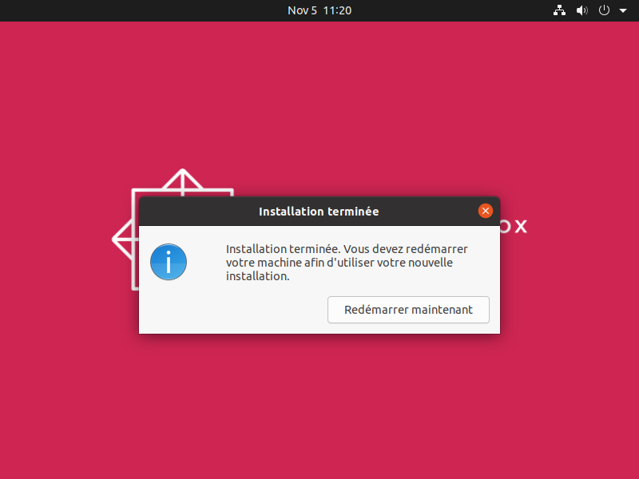
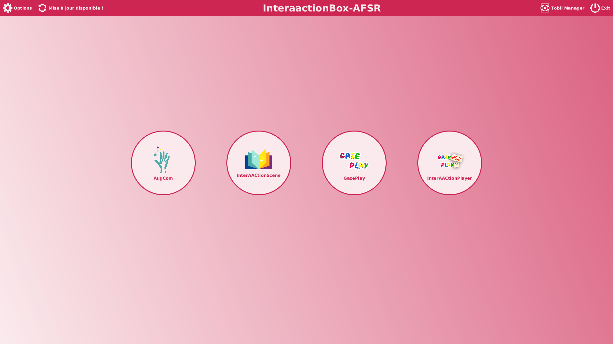
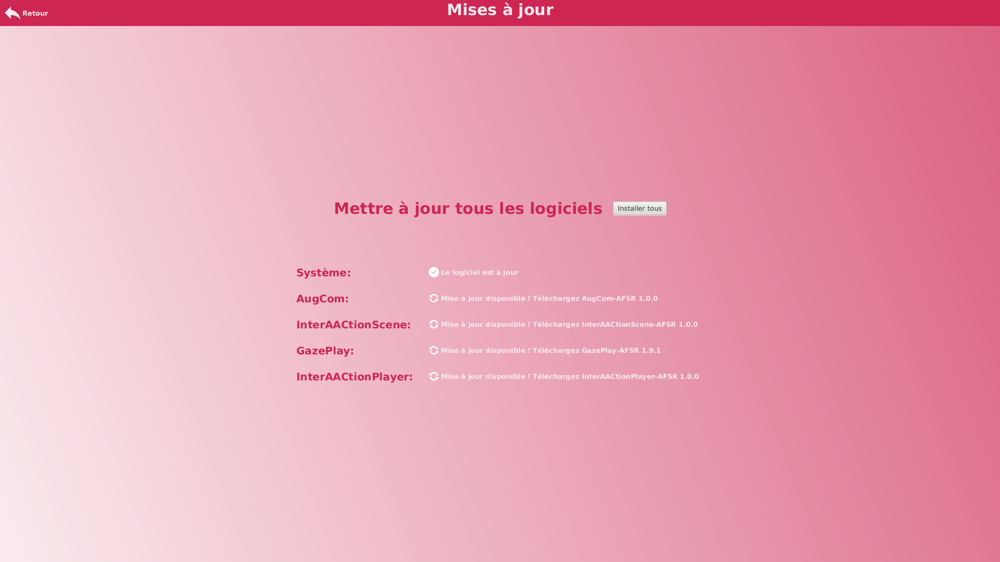

# InterAACtionBox-Live

## Etape 1: boot sur la clé USB

Avant d'allumer l'ordinateur, inséré la clé USB dans l'ordinateur. 
Ensuite allumer l'ordinateur et presser F2 dès que le logo dell apparaît. 

Une fois dans le menu BIOS.

Il faudra aller dans la rubrique "Boot configuration".

Puis il faudra réorganiser les lignes en mettant les ports USB en premier.

Pour finir, appliquer les modifications et redémarrer l'ordinateur.

## Etape 2: installation de l'OS

Avant d'arriver au menu, cet écran de chargement s'affichera, veuillez patienter..

Vous allez arriver sur le premier écran.

Sélectionner "installer interaaaction".  

Choisir la langue de votre clavier.

Choisir votre réseau Wi-Fi (Attention, pour installer les logiciels ou faire les mises à jour une connexion internet est obligatoire !).

Choisir l'installation minimale et laisser le reste par défaut.

Le type d'installation va être demandé, ici 2 choix s'offrent à vous :

- Soit vous décidez de créer un dual boot et vous sélectionnez le premier choix (mais vous aurez assurément des complications si vous avez un window au parallèle).
- Soit vous décidez d'écraser votre ancien système d'exploitation et mettre celui-ci à la place, dans ce cas prendre le second choix.

Si vous prenez le second choix vous aurez une fenêtre qui vous demandera si vous êtes sûr d'écraser le système d'exploitation précédent.

Cliquer sur continuer.  

Sélectionner votre ville puis continuer.

Créer votre utilisateur avec un nom et un mot de passe puis continuer.

Ubuntu va s'installer veuillez attendre.

Une fois l'installation terminée, une fenêtre va apparaître et vous demandera de redémarrer, appuyez sur "redémarrer maintenant".  
Après quelques instants, vous allez vous rentrer sur un écran noir avec le logo de l'interAACtionBox.  
A ce moment la, retirer la clé USB et appuyer sur la touche "Entrer" de votre clavier.  
Attendez encore quelques secondes et votre ordinateur va redemmarer et lancer l'interAAction fraîchement installer.

Une fois connecté, aller dans "Mise à jour disponible !" en haut à gauche de l'écran.

Sur cette page, appuyer sur "installer tous" pour avoir accès à toutes les applications.

## Bug connu

Si l'interAACtion box vous bloque dans les menus et que vous devez sortir, allumez l'ordinateur, sortez du mode veille et allez dans le menu utilisateur, puis redémarrez l'ordinateur.
